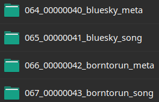
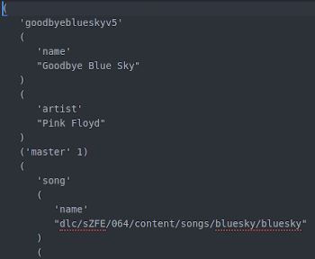

This is a project for EE551: Engineering Programming Python

This project includes a series of tools to be used with RockBand 3 for Wii. (I realize this is a niche application, so I will explain what this entails.)

Background:
  It is possible to play custom songs on Rockband 3 for Wii, but there are several tedious steps that must be done manually for each song in order to be recognized by the software on the Wii. My goal is to automate the process for a batch of songs, with error checking.
  1. Songs must be contained in folders in the following format: 000_00000000_{song_name}_song

  

  2. Song folders must contain a file in which it contains the full file path of the song, among other information

  

  3. Songs must be copied to an external drive to be read by the Wii

My application includes several functions:
  1. It can edit files and file names in order to be read by the Wii's file system
  2. It can check for duplicate songs
  3. It can copy these files to an external USB device
  4. It can automatically convert filetypes to be read by the Wii
  5. It can list all songs installed and sort (by name, artist, track length, etc.)
  6. It has both a GUI (written in Tkinter) and a CLI to achieve these functions

This program was written and tested in Linux. It should work on MacOS due to their similarity, but I do not have access to a Mac for testing, so I am unable to verify.
You will need to install the following packages to your system:
	pip (python3-pip on Ubuntu)
	Tkinter (python3-tk on Ubuntu)
	pytest (python3-pytest on Ubuntu)
Please note that your system may use different package names for the same programs.
